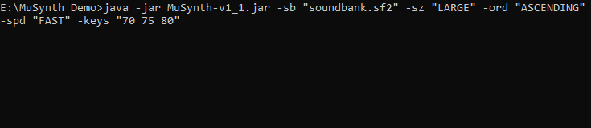
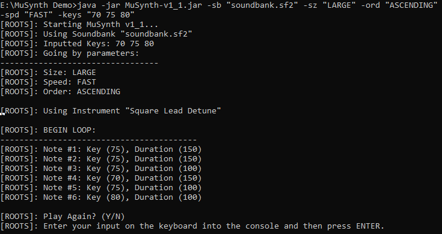
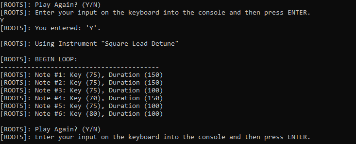
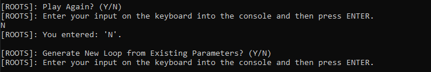
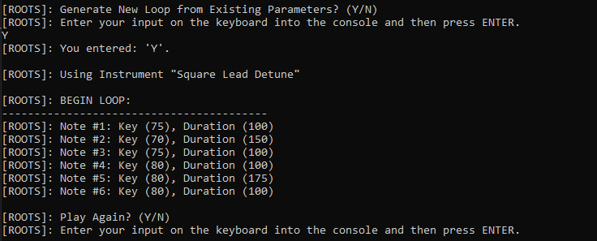
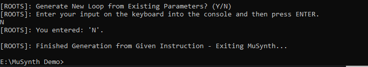

# **MuSynth**

A backend foundation for the generative music Android app "synthOS".

> Constructed as a Java command-line interface, the program or callable API takes simple properties of how the user wants a pattern of notes to sound as input and generates a note pattern on-demand as output.
>    
> The niche problem that the program solves is the challenging task of making a sequence of virtual midi keyboard notes to be used in an electronic music composition.
> The user of a sound production software can get a feel for what notes to use and how to use them by getting note sequences from MuSynth based on the keys used in the sequence, the tempo (or speed) at which they are played, the amount of keys to play, and the pitch (or order - ASCENDING/DESCENDING) to play them in.
> All these properties of music can be used to best formulate sequences of notes that the user may want.
>    
> Using the outputted sequence of notes, the artist can get a feel for how they want to compose an electronic music track, and the problem beginners get stuck with at the beginning of sound production becomes easier to solve.

## **Screenshots**

Begin by inputting parameters/properties as command-line arguments.

A note sequence (AKA "loop") is autonomously generated on-demand and it is played back to the user using javax.sound.midi API.

The user is given the option to playback the loop for accessibility and allows an artist hear the sound of the loop for determining if they have found the right sequence of notes.

If the user would like to use the already inputted parameters to generate a new loop, they can do so.

The user can then repeat the process with a new loop and also exit the program in the case that they have enough of an idea of how they want to make their sequence of notes in their sound production software.